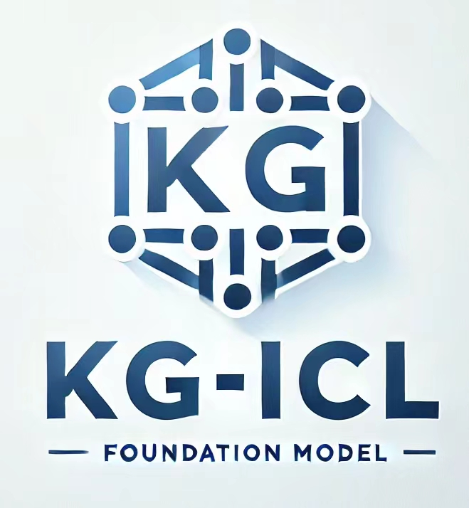
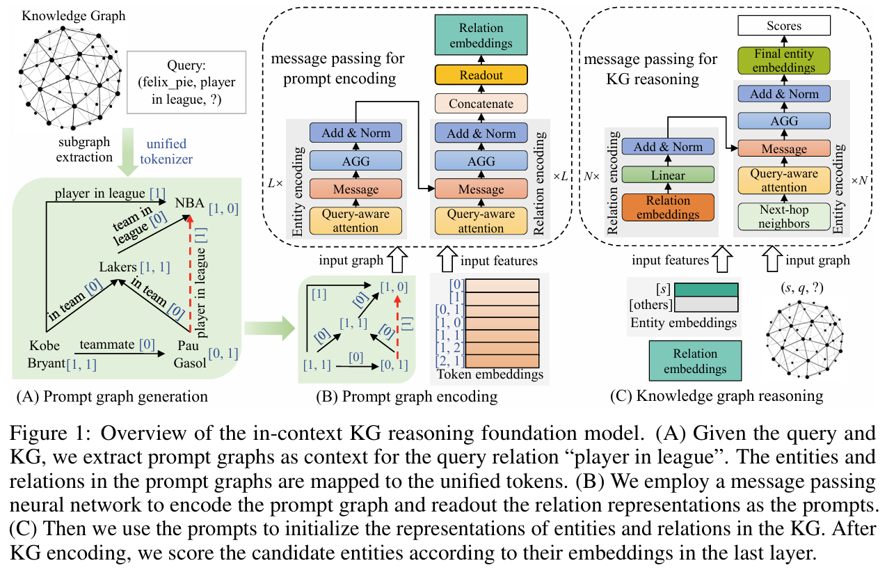

# A Prompt-based Knowledge Graph Foundation Model for Universal In-Context Reasoning
<div align="center">
  
</div>

> Extensive knowledge graphs (KGs) have been constructed to facilitate knowledge-driven tasks across various scenarios. However, existing work usually develops separate reasoning models for different KGs, lacking the ability to generalize and transfer knowledge across diverse KGs and reasoning settings. In this paper, we propose a prompt-based KG foundation model via in-context learning, namely **KG-ICL**, to achieve a universal reasoning ability. Specifically, we introduce a prompt graph centered with a query-related example fact as context to understand the query relation. To encode prompt graphs with the generalization ability to unseen entities and relations in queries, we first propose a unified tokenizer that maps entities and relations in prompt graphs to predefined tokens. Then, we propose two message passing neural networks to perform prompt encoding and KG reasoning, respectively. We conduct evaluation on 43 different KGs in both transductive and inductive settings. Results indicate that the proposed KG-ICL outperforms baselines on most datasets, showcasing its outstanding generalization and universal reasoning capabilities.



# Instructions

A quick instruction is given for readers to reproduce the whole process.


## Install dependencies

    pip install torch==2.1.0 --index-url https://download.pytorch.org/whl/cu118
    pip install torch-scatter==2.1.2 torch-sparse==0.6.18 torch-geometric==2.4.0 -f https://data.pyg.org/whl/torch-2.1.0+cu118.html
    pip install ninja easydict pyyaml tqdm

We use the ``rspmm`` kernel. Please make sure your ``CUDA_HOME`` variable is set properly to avoid potential compilation errors, eg
    
    export CUDA_HOME=/usr/local/cuda-11.8/

## Dataset

Release datasets

    unzip datasets.zip

Process datasets

    cd datasets
    chmod +x process.sh
    ./process.sh

## Quick Start

> If you have any difficulty or question in running code and reproducing experimental results, please email to yncui.nju@gmail.com.

For pre-training
    
    cd src
    python pretrain.py

The checkpoints will be stored in the ``./chechpoint/pretrain/`` fold.

For evaluation, please replace the checkpoint path and test dataset path in the following shell script:
    
    cd shell
    chmod +x test.sh
    ./test.sh

If you want to inference for a specific dataset, please replace the checkpoint path and evaluation dataset path:
    
    cd src
    python evaluation.py --checkpoint_path ./checkpoint/pretrain/kg_icl_6l --test_dataset_list [dataset_name]

For fine-tuning, please replace the checkpoint path and fine-tune dataset path in the following shell script:

    cd shell
    chmod +x finetune.sh
    ./finetune.sh


## Results
We have released three versions of the model, including KG-ICL-4L, KG-ICL-5L, KG-ICL-6L. 
They are training with 4, 5, 6 layers of KG encoder, respectively.
If your device has limited memory, you can choose the KG-ICL-4L model.
If you have enough memory, you can choose the KG-ICL-6L model.
Here are the results of the three models:

### MRR:

| Model | Inductive | Fully-Inductive | Transductive | Average |
| --- | --- | --- | --- | --- |
| Supervised SOTA | 0.466 | 0.210 | 0.365 | 0.351 |
| ULTRA (pretrain) | 0.513 | 0.352 | 0.329 | 0.396 |
| ULTRA (finetune) | 0.528 | 0.350 | 0.384 | 0.421 |
| KG-ICL-4L (pretrain) | 0.550 | 0.434 | 0.328 | 0.433 |
| KG-ICL-5L (pretrain) | 0.554 | 0.438 | 0.346 | 0.441 |
| KG-ICL-6L (pretrain) | 0.550 | 0.442 | 0.350 | 0.443 |
| KG-ICL-6L (finetune) | 0.592 | 0.444 | 0.413 | 0.481 |

### Hits@10:

| Model | Inductive | Fully-Inductive | Transductive | Average |
| --- | --- | --- | --- | --- |
| Supervised SOTA | 0.607 | 0.347 | 0.511 | 0.493 |
| ULTRA (pretrain) | 0.664 | 0.536 | 0.479 | 0.557 |
| ULTRA (finetune) | 0.684 | 0.542 | 0.548 | 0.590 |
| KG-ICL-4L (pretrain) | 0.696 | 0.622 | 0.471 | 0.590 |
| KG-ICL-5L (pretrain) | 0.705 | 0.635 | 0.501 | 0.608 |
| KG-ICL-6L (pretrain) | 0.706 | 0.642 | 0.504 | 0.611 |
| KG-ICL-6L (finetune) | 0.738 | 0.640 | 0.566 | 0.644 |


## Citation
If you find the repository helpful, please cite the following paper
```bibtex
@inproceedings{cui2024prompt,
  title = { A Prompt-based Knowledge Graph Foundation Model for Universal In-Context Reasoning },
  author = { Cui, Yuanning and 
            Sun, Zequn and 
            Hu, Wei },
  booktitle = { NeurIPS },
  year = { 2024 }
}

